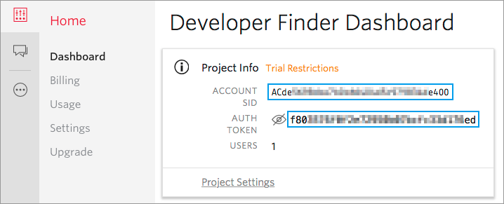
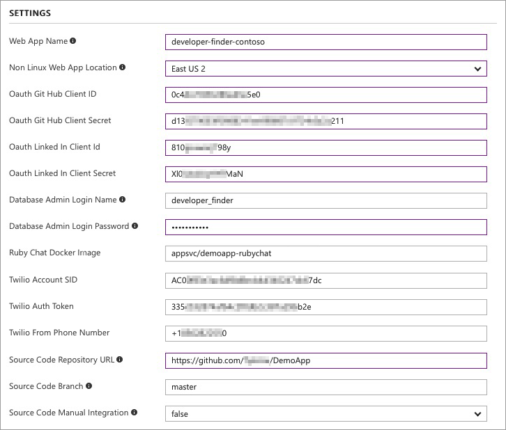
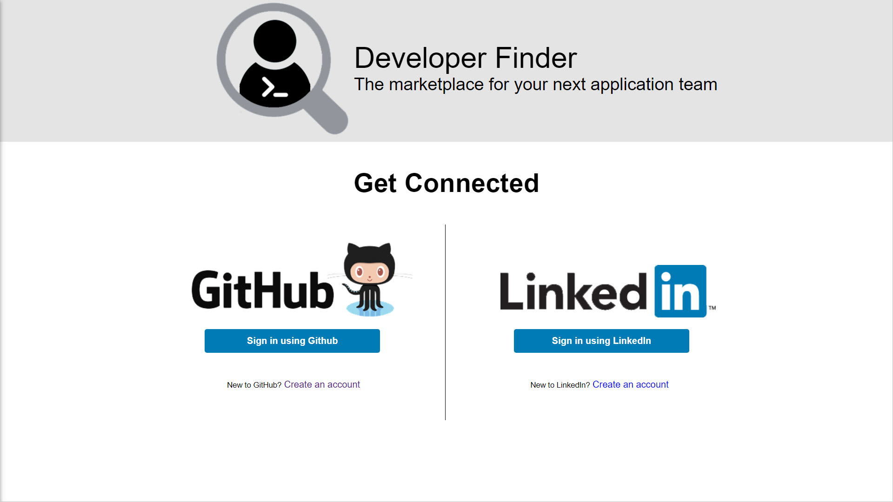

# Azure Web Application for Containers - Developer Finder

The Developer Finder application is a container based application that demonstrates how to make a web application with multiple technologies and containers.  

This sample includes a web application that allows users to authenticate and register with their GitHub and LinkedIn accounts, import data into their user profiles from those systems, and supplement their profile with additional information.  The web application also provides users the ability to search for developers based on the information in their profile, and even suggests friends based on common profile information.

In addition to the profile and search capabilities, the web application interacts with a custom chat system that allows users to engage in chat conversation in the web site.

The entire application is packaged inside Docker containers and deployed to Microsoft Azure.  In addition to the container apps, Azure resources such as a MySQL database, Application Insights, and other Azure services are used to implement the application.

**Table of contents**

* [Architecture](#architecture)
  * [Developer Finder App](#developer-finder-app)
  * [Chat App](#chat-app)
* [Deployment](#deployment)
  * [Choose a name for the app](#choose-a-name-for-the-app)
  * [Register OAuth applications](#register-oauth-applications)
  * [GitHub Authorization](#gitHub-authorization)
  * [Deploy the Azure Components](deploy-the-azure-components)
  * [Set up the CI/CD](#set-up-the-ci-cd)
  * [Validate deployment](#validate-deployment)
* [How to use](#how-to-use)

## Architecture 

The following diagram illustrates the overall system architecture.

The main components of the application are described in subsequent sections in this document.

### Web App

1. Back-end - A Python App. 

  * Uses the [Flask microframework](http://flask.pocoo.org/) to implement the web app and routing.
  * Uses the [Python Social Auth](https://python-social-auth.readthedocs.io/en/latest/) library to enable GitHub/LinkedIn accounts to login and returns user profile information from these systems.
  * Uses [Azure Database for MySQL](https://azure.microsoft.com/en-us/services/mysql/).
  * Uses [peewee](http://docs.peewee-orm.com/en/latest/) for ORM access to the MySQL Database.

     The back-end app exposes the following APIs:

  | Action | Path                    | Description |
  | ------ | ----------------------- | ----------- |
  | GET    | /api/me                 |             |
  | POST   | /api/me                 |             |
  | GET    | /api/connected-accounts |             |
  |        |                         |             |
  |        |                         |             |
  |        |                         |             |
  |        |                         |             |
  |        |                         |             |
  |        |                         |             |

2. Front-end - An AngularJS App.

3. Nginx
   ​

### Chat App

The Chat App is a very simple chat back-end application.
It does not include an authorization/authentication module, and has no user interface.

* Built on [Ruby](https://www.ruby-lang.org/en/).
* Uses a [PostgreSQL database](https://www.postgresql.org/). 

The Ruby Chat app exposes the following APIs:

| Action | Path                             | Description         |
| ------ | -------------------------------- | ------------------- |
| POST   | /api/messages                    | Send a new message  |
| GET    | /api/messages/summary?to=2       | Get message summary |
| GET    | /api/messages/unread?from=1&to=2 | Get unread messages |

### Azure Services

Azure Services are also used to implement the application.  The following services are used.

1. Function App
  * Logs custom metrics to Application Insights
2. Logic App
  * Sends SMS text messages to users when they receive a message in the chat portion of the application.
3. Application Insights
  * Store custom metrics for the application.

### Databases

1. MySQL Database - Web App

   | Table          | Description |
   | -------------- | ----------- |
   | user           |             |
   | usersocialauth |             |
   | profile        |             |
   | position       |             |
   | friend         |             |
   |                |             |

   ​

2. PostgreSQL Database - Chat App

   | Table                | Description |
   | -------------------- | ----------- |
   | messages             |             |
   | message_read_records |             |
   ​

## Deployment

### Choose a name for the app

The name of the application is 'Developer Finder'. We suggest you follow the naming convention below when creating your instance of the application:

​	**developer-finder-[suffix]**

The suffix is used to avoid azure resource naming conflicts. It is strongly recommended you only use lowercase letters (a-z), numbers (0-9), and hyphens (-). 

Below are some examples:

* developer-finder-contoso (company name is used)
* developer-finder-0901-1200 (date and time are used)

In this document, we use the first example to show you how to deploy the solution to Azure. When you are finished with the deployment, you will be able to visit it by navigating to this URL in a web browser:

​	https://developer-finder-contoso.azurewebsites.net

### Register OAuth applications

To start, you must register OAuth applications for GitHub and LinkedIn.  These OAuth applications allow the application to authenticate to GitHub and LinkedIn and download user profile information stored in these systems.

#### Register GitHub OAuth application

1. Sign into GitHub
2. Open https://github.com/settings/applications/new
3. Fill the form with the following information:

   * Application name: **Developer Finder**

   * Homepage URL: **https://developer-finder-[suffix].azurewebsites.net**

      > **Note:** Replace the **[suffix]** placeholder with the one you choose to use.  Use this same value throughout the deployment process.
      > 	> 
      > 	> **Example:** https://developer-finder-contoso.azurewebsites.net

   * Authorization callback URL: **https://developer-finder-[suffix].azurewebsites.net/complete/github/**

     > **Note:** Replace the **[suffix]** placeholder with the one you choose to use.  Use this same value throughout the deployment process.
     > 	> 
     > 	> **Example:** https://developer-finder-contoso.azurewebsites.net/complete/github/

4. Click **Register application**.
5. Copy aside the **ClientID** and **Client Secret**. 

   > Note: These values will be used for the **SOCIAL_AUTH_GITHUB_KEY** and **SOCIAL_AUTH_GITHUB_SECRET** ARM template parameters.

#### Register LinkedIn OAuth application

1. Sign into LinkedIn.
2. Open https://www.linkedin.com/developer/apps/new
3. Fill the form with the following information:

   * Name: **Developer Finder**

   * Application Logo: download and use the image below

     

   * Website URL: **https://developer-finder-[suffix].azurewebsites.net**
      > **Note:** Replace the **[suffix]** placeholder with the one you choose to use.  Use this same value throughout the deployment process.
      > 	> 
      > 	> **Example:** https://developer-finder-contoso.azurewebsites.net

4. Input the other required fields, then click **Submit**.
5. Add the OAuth 2 Authorized Redirect URL: **https://developer-finder-[suffix].azurewebsites.net/complete/linkedin-oauth2/**
   > **Note:** Replace the **[suffix]** placeholder with the one you choose to use.  Use this same value throughout the deployment process.
   > 		> 
   > 		> **Example:** https://developer-finder-contoso.azurewebsites.net/complete/linkedin-oauth2/

6. Click **Update**.
7. Copy aside the **ClientID** and **Client Secret**. 

   > Note: These values will be used for the **SOCIAL_AUTH_LINKEDIN_OAUTH2_KEY** and **SOCIAL_AUTH_LINKEDIN_OAUTH2_SECRET** ARM template parameters.

### GitHub Authorization

1. Generate Token

   - Open https://github.com/settings/tokens in your web browser

   - Sign into GitHub

   - Fork this repository to your GitHub account

   - Click **Generate Token**

   - Enter a value in the **Token description** text box

   - Select the following checkboxes (your selections should match the screenshot below):

     - repo (all) -> repo:status, repo_deployment, public_repo

     - admin:repo_hook -> read:repo_hook

       

2. Add the GitHub Token to Azure in the Azure Resource Explorer

   * Open https://resources.azure.com/providers/Microsoft.Web/sourcecontrols/GitHub in your web browser.

   * Log in with your Azure account.

   * Selected the correct Azure subscription.

   * Select **Read/Write** mode.

   * Click **Edit**.

   * Paste the token into the **token parameter**.

     

   * Click **PUT**.

### [Optional] Register a Twilio account to send SMS 

A [trial](https://www.twilio.com/try-twilio) Twilio account could not be used here, as there are several limitations, like it can only send messages to to verfied numbers. If you have not [updated](https://www.twilio.com/console/billing/upgrade) your account, please skip this section.

Follow the step below to get the requirement informations:

1. Navigate to **[Dashboard](https://www.twilio.com/console/sms/dashboard)**, then click **Show API Credentials**. Copy aside the values of **ACCOUNT ID** and **AUTH TOEKN**.

   

   > Note: These 2 values will be used for the **Twilio Account SID** and **Twilio Auth Token** ARM template parameters.

2. Navigate to **[Phone Number page](https://www.twilio.com/console/phone-numbers/incoming)**, copy aside a phone number (add one if there is none). Remove the spaces and hyphens, it will look like **+12223334444**.

> Note: These phone number will be used for the **Twilio From Phone Number** ARM template parameter.

1. Goto **Dashboard**, 

### Deploy the Azure Components

1. In your web browser, navigate to your fork of this repository.

2. Click the **Deploy to Azure** button below:

   

3. Fill in the values in the deployment page:

  

   * Resource group: 

     We suggest you create a new resource group and name it **DeveloperFinderRG**.

   * Location: 

     Web Apps on Linux are currently (2017/08) only available in the following regions. So, you must choose one of the regions below:

     * West US
     * East US
     * West Europe
     * North Europe
     * South Central US
     * North Central US
     * Southeast Asia
     * East Asia
     * Australia East
     * Japan East
     * Brazil South
     * South India

  

   * Web App Name: 

     Use the name you chose at the start of these instructions that follows the **developer-finder-[suffix]** namign convention.

   > **Example:** https://developer-finder-contoso.azurewebsites.net

   * Non Linux Web App Location: 

     You **MUST choose a different region for the non-Linux web apps**, because they cannot be created in the same region and the same resource group.

   * OAuth Git Hub Client Id & Secret: 

     Use the client id and secret of the GitHub OAuth app.

   * OAuth LinkedIn Client Id & Secret: 

     Use the client id and secret of the LinkedIn OAuth app.

   * Twilio Acount SID & Auth Token & From Phone Number.

     Use the values you got form you Twilio account.

   * Database Admin Login Name: 

     It cannot be 'azure_superuser', 'admin', 'administrator', 'root', 'guest' or 'public'.

   * Database Admin Login Password: 

     This field should be between 8 and 128 characters long. Your password must contain characters from three of the following categories – English uppercase letters, English lowercase letters, numbers (0-9), and non-alphanumeric characters (!, $, #, %, etc.).

   * Ruby Chat Docker Image

   TODO: Need to add the path to this image.

   * Source Code Repository URL:

     Use the URL of the repository you just cloned.

4. Select the **I agree to the terms and conditions stated above** checkbox.

5. Click **Purchase**.
6. Wait until the ARM template deployment process completes.

### Set up CI/CD

1. Navigate to the resource group you just created and deployed, then click the **developer-finder-[suffix]** Web App:

   

2. Click **Continous Delivery**, then click **Configure**.

   

3. Click **Choose container registry**, the preconfigured private registry will be loaded.

   

4. Click **Save** (the right one).

5. Click **Configure continuous delivery**:

   

   * Code repository: choose **GitHub**
   * Repository: choose this GitHub repository that you forked.
   * Branch: choose **master**
   * Dockerfile path: change it to **Dockerfile**

6. Click **Save **(the right one).

7. Click **Select a Team Service account**:

   

   * Create a new account or using an existing one.
   * Create a new project or using an existing one.

8. Click **Save** (the right one).

9. Click **Save**. 

   > Note: It takes a few minutes to finish:
   >
   > 

### Validate deployment

1. Open the https://**developer-finder-[suffix]**.azurewebsites.net web app.

  > Note: Make sure you replace the [suffix] placeholder with the value you have used throughout the deployment process.

  You will see the login page:

  

  > Note: If you get a "502 Bad Gateway" error, please wait for a few minutes and try again. 

## Demo scenario overview and flow

See the [Demo Script](/Demo Script.pptx) slide deck.

## Running the demo

Follow the steps in [Demo Script](/Demo Script.pptx) slide deck.

